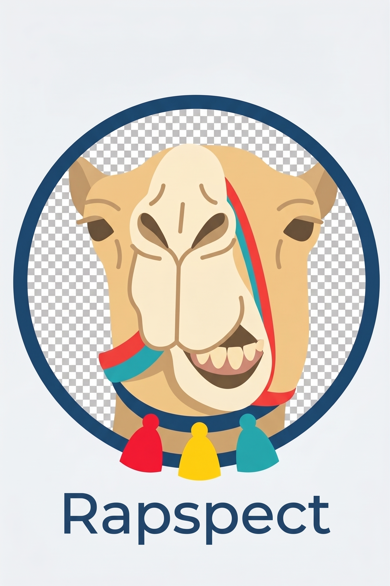

<p align="center">
  
</p>

<h1 align="center">Rapspect</h1>

<p align="center">
  Track your page — console logs and network requests, made readable.
</p>

---

**Status:** Design Phase — belum ada kode. Dokumen ini adalah brief desain dan
spesifikasi aset.

## 1. Deskripsi

**Rapspect** adalah Chrome extension (Manifest V3) yang menampilkan **console log**
dan **network request** dari halaman web yang sedang dibuka, dalam satu panel yang
lebih ringkas dan lebih mudah diakses dibanding tab Console dan Network di DevTools
bawaan Chrome.

## 2. Masalah yang diselesaikan

Ditulis dari sudut pandang QA engineer yang melakukan pengujian manual setiap hari:

1. **DevTools terlalu padat untuk kebutuhan sehari-hari.** Saat menguji, yang
   dibutuhkan biasanya hanya error/warning dan request yang gagal — bukan seluruh
   isi tab Network.
2. **Menyalin bukti ke bug report itu lambat dan manual.** Klik kanan, copy, tempel,
   ulangi baris per baris, lalu rapikan formatnya.
3. **Informasi tersebar di dua tab.** Error console dan request yang gagal sering
   berkaitan, tapi harus dilihat bergantian.

## 3. Tujuan

- Menampilkan console log dan network request **dalam satu panel** yang sama
- Default menyorot yang penting: `error`, `warn`, dan request dengan status `>= 400`
- Ekspor satu klik ke teks atau JSON untuk ditempel ke bug report
- Tetap terlihat tanpa harus membuka DevTools

## 4. Ruang lingkup v1

**Termasuk:**
- [ ] Menangkap `console.log / info / warn / error / debug` dari halaman
- [ ] Menangkap uncaught error dan unhandled promise rejection
- [ ] Menangkap request `fetch()` dan `XMLHttpRequest`: method, URL, status,
      durasi, ukuran response
- [ ] Filter per level log + filter "hanya request gagal (status >= 400)"
- [ ] Pencarian teks
- [ ] Clear, Copy as text, Export JSON
- [ ] Ring buffer 500 entri terakhir
- [ ] Redaction untuk header/field sensitif
- [ ] Dark mode (default) dan light mode

**Sengaja TIDAK termasuk di v1:**
- `chrome.debugger` / Chrome DevTools Protocol — menimbulkan banner peringatan
  "sedang di-debug" dan bentrok jika DevTools terbuka. Ditunda ke v2.
- Membaca **response body** — butuh `chrome.debugger` atau
  `chrome.devtools.network`. Ditunda.
- Log browser yang bukan dari console API (error CORS, pelanggaran CSP)
- Memblokir atau memodifikasi request
- Penyimpanan lintas sesi

---

## 5. Identitas visual

### Logo

Kepala onta kartun yang tersenyum di dalam badge lingkaran navy, dengan tali kekang
bergaris merah-teal dan tiga tassel (merah, kuning, teal). Wordmark "Rapspect"
dalam sans-serif navy.

Gaya: **flat vector, outline tebal, cerah, ramah.** Bukan monoline minimalis, bukan
dark-moody.

### Karakter dan mood

Onta itu bukan sekadar hiasan — dia **pemandu yang melacak jejak**. Yang dijanjikan
adalah kecepatan dan kemampuan menemukan jejak, bukan gurun yang sepi. Senyumnya
menetapkan nada produk: alat yang ramah dipakai, bukan konsol yang mengintimidasi.

Mood keywords: `ramah` · `cepat` · `pelacak jejak` · `jelas` · `terarah`

### Aturan paling penting

> **Tema hidup di kulit aplikasi. Area data harus membosankan dan sangat terbaca.**

Logo, warna, empty state, dan header boleh bertema. **Area daftar log tidak.**
Jangan pernah menerjemahkan istilah teknis ke kosakata gurun — pengguna harus bisa
memindai status `404` dalam sepersekian detik, bukan menerjemahkan dulu.

| Boleh | Jangan |
|---|---|
| Empty state: "No tracks yet" | Ganti label "Network" jadi "Caravan" |
| Ikon jejak kaki untuk tab log | Ganti "Error" jadi "Sandstorm" |
| Logo onta di header | Maskot beranimasi terus-menerus |
| Ilustrasi onta di banner README | Efek dekoratif di dalam baris log |

---

## 6. Design tokens

Warna di bawah adalah **perkiraan yang diambil dari file JPG**. Kompresi JPG
menggeser warna — ambil nilai sebenarnya dari file sumber desain dengan color
picker, lalu perbarui bagian ini.

```css
/* ---------- BRAND (dari logo) ---------- */
:root {
  --rp-navy:        #1F3A5F;   /* badge, header, wordmark */
  --rp-navy-deep:   #16293F;
  --rp-sand:        #E8C68F;   /* bulu onta */
  --rp-sand-dark:   #D4A96A;
  --rp-cream:       #FAF0DC;   /* moncong */
  --rp-brown:       #6B4A2E;   /* outline organik */

  /* Tiga tassel = palet semantik log, gratis dari logo */
  --rp-red:         #EE3B33;
  --rp-yellow:      #FFD21E;
  --rp-teal:        #159FA8;
}

/* ---------- DARK (default) ---------- */
:root {
  --rp-bg:          #101C2E;
  --rp-surface:     #16293F;
  --rp-surface-alt: #1D3352;   /* baris zebra */
  --rp-border:      #2C4A70;
  --rp-text:        #FAF0DC;
  --rp-text-muted:  #A8BACD;

  --rp-error:       #FF6B5E;   /* merah tassel, dicerahkan agar kontras cukup */
  --rp-warn:        #FFD21E;
  --rp-info:        #3FBFC7;
  --rp-success:     #4FC98A;
  --rp-debug:       #9AA8BC;
}

/* ---------- LIGHT ---------- */
[data-theme="light"] {
  --rp-bg:          #F0F3F7;   /* seperti latar file logo */
  --rp-surface:     #FFFFFF;
  --rp-surface-alt: #F7F9FB;
  --rp-border:      #D6DEE8;
  --rp-text:        #16293F;
  --rp-text-muted:  #5A6B7F;

  --rp-error:       #D32F27;
  --rp-warn:        #B58600;   /* kuning tassel TIDAK terbaca di latar putih */
  --rp-info:        #0E7C85;
  --rp-success:     #1E8E5A;
}
```

### Tiga aturan warna yang wajib dipatuhi

1. **Navy hanya untuk chrome aplikasi** (header, tombol utama, logo). Tidak pernah
   sebagai penanda makna di dalam daftar log.
2. **Satu warna, satu makna.** Merah selalu berarti error. Kuning selalu warning.
   Teal selalu info/success. Tidak ada pengecualian.
3. **Kuning `#FFD21E` tidak boleh dipakai sebagai teks di latar terang** — kontrasnya
   jauh di bawah ambang. Di light mode wajib diperdalam ke `#B58600`. Semua warna
   semantik harus lolos rasio kontras minimal 4.5:1 di kedua tema; verifikasi
   sebelum implementasi.

---

## 7. Tipografi

| Penggunaan | Font | Fallback | Alasan |
|---|---|---|---|
| UI (label, tombol, menu) | Inter | system-ui, sans-serif | Netral, dekat dengan wordmark logo |
| Isi log, URL, JSON | JetBrains Mono | Cascadia Code, Consolas, monospace | **Wajib monospace** — timestamp, status code, dan JSON harus rata kolom |

Ukuran dasar: 13px untuk isi log, 14px untuk UI, line-height 1.5.

---

## 8. Ikon

**Jangan menggambar ikon UI sendiri.** Pakai Lucide (https://lucide.dev), lisensi
MIT. Yang dibuat kustom hanya logo/maskot. Konsistensi: stroke 1.5–2px, grid
20–24px, ujung membulat.

| Fungsi | Ikon Lucide |
|---|---|
| Tab console log | footprints |
| Tab network | route |
| Search | search |
| Filter | filter |
| Clear | trash-2 |
| Copy as text | copy |
| Export JSON | download |
| Redaction aktif | eye-off |
| Toggle tema | sun / moon |
| Pause capture | pause |

---

## 9. Aset desain

### Masalah pada file logo saat ini

File `assets/Rapspect.jpg` **belum bisa dipakai sebagai ikon extension.**

Kotak-kotak abu-abu di dalam lingkaran badge itu **bukan transparansi — itu piksel
asli**. JPG tidak mendukung alpha channel, jadi pola papan catur yang berarti
"transparan" di editor gambar ikut ter-render permanen sebagai bagian dari gambar.
Kalau file ini dipakai langsung, ikon extension akan benar-benar berlatar papan catur.

Perbaikan yang diperlukan:
- [ ] Ekspor ulang ke **PNG dengan transparansi asli**, atau isi lingkaran dengan
      warna solid (disarankan `--rp-cream` atau putih)
- [ ] Simpan **file sumber vektor** (SVG/AI/Figma). Raster tidak bisa diperbesar
      tanpa kehilangan kualitas.

### Ikon extension

Ikon dirender **16x16** di toolbar Chrome. Wajah onta dengan mata, gigi, kerutan,
dan tiga tassel akan menjadi gumpalan tak terbaca di ukuran itu. Yang dibutuhkan
adalah **penyederhanaan progresif** — empat gambar dengan tingkat detail berbeda
yang tetap terasa satu keluarga, bukan satu gambar yang diperkecil.

| # | Aset | Ukuran | Format | Tingkat detail | Status |
|---|---|---|---|---|---|
| 1 | icon16.png | 16x16 | PNG | Bentuk paling sederhana yang masih terbaca sebagai onta. Tanpa tassel, tanpa gigi. | [ ] |
| 2 | icon32.png | 32x32 | PNG | Kepala onta, outline disederhanakan | [ ] |
| 3 | icon48.png | 48x48 | PNG | Kepala terbaca, tassel mulai muncul | [ ] |
| 4 | icon128.png | 128x128 | PNG | Logo penuh apa adanya | [ ] |
| 5 | logo-master.svg | vektor | SVG | Sumber utama, semua varian diturunkan dari sini | [ ] |

### Branding & UI

| # | Aset | Ukuran | Format | Keterangan | Status |
|---|---|---|---|---|---|
| 6 | Rapspect.jpg | — | JPG | Logo awal (perlu diekspor ulang) | [x] |
| 7 | wordmark.svg | vektor | SVG | "Rapspect" + mark, versi horizontal | [ ] |
| 8 | empty-state.svg | ~320x200 | SVG | Onta + "No tracks yet" | [ ] |
| 9 | readme-banner.png | 1280x640 | PNG | Header README GitHub | [ ] |
| 10 | og-image.png | 1280x640 | PNG | GitHub social preview | [ ] |

### Chrome Web Store (kalau nanti dipublikasikan)

| # | Aset | Ukuran | Status |
|---|---|---|---|
| 11 | Small promo tile | 440x280 | [ ] |
| 12 | Marquee promo tile | 1400x560 | [ ] |
| 13 | Screenshot (min. 1, maks. 5) | 1280x800 | [ ] |

> Persyaratan ukuran Chrome Web Store berubah dari waktu ke waktu — verifikasi ke
> dokumentasi resmi sebelum submit.

### Struktur folder aset

```
rapspect/
├── README.MD
└── assets/
    ├── source/       SVG/Figma master — JANGAN dihapus
    ├── icons/        icon16/32/48/128.png
    ├── branding/     wordmark, banner, og-image
    ├── ui/           empty-state
    └── store/        promo tile, screenshot
```

---

## 10. Panduan bahasa UI

Label UI berbahasa **Inggris** (standar developer tool). Dokumentasi Bahasa Indonesia.

- Ringkas dan langsung: `Clear`, `Export JSON`, `Failed only`
- Empty state boleh punya karakter:
  `No tracks yet — reload the page to start tracking.`
- Pesan error harus menyebut jalan keluarnya, bukan sekadar puitis:
  - BENAR: `Can't read this page. Extensions can't access chrome:// or Web Store pages.`
  - SALAH: `The desert is silent here.`

---

## 11. Catatan keamanan

Rapspect menangkap header dan isi request. Artinya token `Authorization`, password
di form login, dan data pribadi **bisa ikut tertangkap** — lalu masuk ke file JSON
yang diekspor, lalu menempel di bug report atau repo publik.

**Redaction wajib ada sejak v1, bukan ditambahkan nanti:**
- Header disensor default: `Authorization`, `Cookie`, `Set-Cookie`, `X-Api-Key`
- Field body disensor default: `password`, `token`, `secret`, `apiKey`, `pin`
- Indikator jelas di UI kalau redaction aktif atau dimatikan
- Peringatan di dialog Export

---

## 12. Open questions

- [ ] Ejaan final: "Rapspect" (sesuai logo) — konfirmasi
- [ ] Tempat UI: side panel (`chrome.sidePanel`), DevTools panel, atau popup?
- [ ] Apakah nama "Rapspect" sudah dipakai di Chrome Web Store / GitHub / npm?
      **Cek sebelum investasi lebih jauh.**
- [ ] Publikasi ke Chrome Web Store, atau cukup portofolio GitHub?
- [ ] Lisensi repo (MIT?)

---

## 13. Roadmap

| Versi | Isi |
|---|---|
| v0.1 | Dokumentasi, logo, design token (sekarang) |
| v1.0 | Capture console + fetch/XHR, filter, search, export, dark mode |
| v1.1 | Light mode, redaction yang bisa dikonfigurasi, pause capture |
| v2.0 | `chrome.debugger` opsional: response body, error browser-level |
| v2.1 | Ekspor format bug report siap tempel (Markdown/Jira) |

---

## 14. Changelog

| Tanggal | Perubahan |
|---|---|
| 2026-09-28 | Dokumen awal + logo Rapspect; design token diturunkan dari logo |